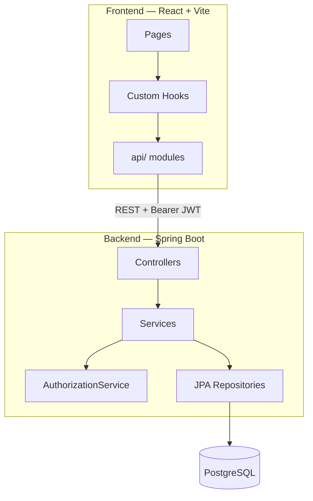

# IssueTracker

A full-stack issue tracking application inspired by **Linear** and **Jira** — built for teams to manage projects, assign work, track progress, and collaborate through comments and activity logs.

React SPA on the frontend. Spring Boot REST API on the backend. PostgreSQL for persistence. JWT for stateless authentication.

---

## Highlights

- **End-to-end product** — not just an API; includes a polished React UI with auth, dashboards, filters, and modals
- **Clean architecture** — strict separation between UI, hooks, API layer (frontend) and controller → service → repository (backend)
- **Production-minded patterns** — DTOs, global exception handling, centralized authorization, CORS, BCrypt, audit trail
- **Real workflow rules** — issue lifecycle (`OPEN → IN_PROGRESS → DONE`), owner-only assignment, assignee-only status updates

---

## Features

| Area | Capabilities |
|------|----------------|
| **Auth** | Register, login, JWT sessions, protected routes, auto-logout on 401 |
| **Projects** | Create projects, add team members by email, member list with names |
| **Issues** | Create (modal), assign to members, status transitions, filter by status/assignee |
| **Dashboard** | Recent projects + issues assigned to you |
| **My Issues** | Dedicated view for all issues assigned to the current user |
| **Comments** | Add and view comments on issue detail pages |
| **Activity** | Automatic audit log (created, assigned, status changed) |

---

## Tech Stack

| Layer | Technologies |
|-------|----------------|
| **Frontend** | React 19, Vite, React Router v6, Axios, Tailwind CSS |
| **Backend** | Spring Boot 4, Spring Security, Spring Data JPA |
| **Database** | PostgreSQL |
| **Auth** | JWT (HS256), BCrypt password hashing |
| **Build** | Maven (backend), npm (frontend) |
| **Language** | Java 21, JavaScript (ES modules) |

---

## Architecture



### Frontend structure

```
frontend/src/
├── api/           # Axios HTTP calls (no UI logic)
├── hooks/         # useAuth, useProjects, useIssues
├── pages/         # Route-level screens
├── components/    # Reusable UI (layout, issue, project)
├── providers/     # Auth context
└── utils/         # Token, dates, errors
```

### Backend structure

```
backend/src/main/java/com/issuetracker/
├── controller/    # REST endpoints
├── service/       # Business logic + auth services
├── repository/    # Spring Data JPA
├── entity/        # User, Project, Issue, Comment, IssueActivity
├── dto/           # Request & response objects
├── mapper/        # Entity ↔ DTO conversion
├── security/      # JWT filter, SecurityConfig
└── exception/     # GlobalExceptionHandler
```

---

## Security Model

| Action | Who can do it |
|--------|----------------|
| View project / issues | Project member |
| Create / update / delete project | Project owner |
| Add team members | Project owner |
| Create issue / comment | Project member |
| Assign issue | Project owner |
| Update issue status | Assignee only |

Authentication flow: login → JWT issued → Axios interceptor attaches `Authorization: Bearer <token>` → `JwtAuthenticationFilter` validates on every request → `AuthorizationService` enforces business rules.

---

## API Overview

Base URL: `http://localhost:8080/api`

<details>
<summary><strong>Auth</strong> (public)</summary>

| Method | Endpoint | Description |
|--------|----------|-------------|
| POST | `/auth/register` | Create account |
| POST | `/auth/login` | Get JWT token |

</details>

<details>
<summary><strong>Projects</strong></summary>

| Method | Endpoint | Description |
|--------|----------|-------------|
| GET | `/projects` | List user's projects |
| GET | `/projects/{id}` | Project details + members |
| POST | `/projects` | Create project |
| PUT | `/projects/{id}` | Update project |
| DELETE | `/projects/{id}` | Delete project |
| POST | `/projects/{id}/members` | Add member by email |

</details>

<details>
<summary><strong>Issues</strong></summary>

| Method | Endpoint | Description |
|--------|----------|-------------|
| POST | `/issues/projects/{projectId}` | Create issue |
| GET | `/issues/{id}` | Get issue |
| GET | `/issues/projects/{projectId}` | List project issues (paginated) |
| GET | `/issues/my` | Issues assigned to current user |
| PATCH | `/issues/{id}/assign?assigneeId=` | Assign issue |
| PATCH | `/issues/{id}/status?status=` | Update status |
| GET | `/issues/{id}/activities` | Activity timeline |

</details>

<details>
<summary><strong>Comments</strong></summary>

| Method | Endpoint | Description |
|--------|----------|-------------|
| GET | `/comments/issues/{issueId}` | List comments |
| POST | `/comments/issues/{issueId}` | Add comment |
| DELETE | `/comments/{id}` | Delete own comment |

</details>

---

## Getting Started

### Prerequisites

- **Java 21**
- **Node.js 18+** and npm
- **PostgreSQL** running locally

### 1. Database

Create a PostgreSQL database:

```sql
CREATE DATABASE "IssueTracker";
```

### 2. Backend

```bash
cd backend

# Configure database credentials
cp src/main/resources/application.properties.example src/main/resources/application.properties
# Edit application.properties with your PostgreSQL username/password

# Run (Windows)
.\mvnw.cmd spring-boot:run

# Run (macOS / Linux)
./mvnw spring-boot:run
```

API available at **http://localhost:8080**

### 3. Frontend

```bash
cd frontend
npm install
npm run dev
```

App available at **http://localhost:5173**

### 4. Production build (optional)

```bash
cd frontend && npm run build
cd backend && ./mvnw package
```

---

## Data Model

```
User ──owns──► Project ◄──member── User
                  │
                  └──has many──► Issue ──has many──► Comment
                                    │
                                    └──has many──► IssueActivity
```

**Issue status flow:** `OPEN` → `IN_PROGRESS` → `DONE`

**Issue types:** `BUG`, `FEATURE`, `IMPROVEMENT`

---

## Design Decisions

- **DTO pattern** — entities never exposed over the wire; mappers control the API contract
- **Custom React hooks** — data fetching without React Query; keeps dependencies minimal
- **Stateless JWT** — no server-side sessions; scales horizontally
- **Activity logging** — every create, assign, and status change is auditable
- **Client-side issue filters** — fast UX for project views; server pagination available via API

---

## Author

**Sayeesh Mahale**  
Information Science Engineering · Vidyavardhaka College of Engineering

---

## License

This project is for portfolio and educational purposes.
